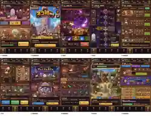
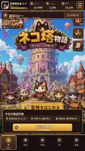

# Cat's Tower — 画面・完成イメージVisual Bible 1

文書状態: **REFERENCE INTERPRETATION CONTRACT / NOT USER-APPROVED FINAL / NOT RUNTIME ASSET**  
作成日: **2026-09-04 JST**  
対象画像: repository thumbnails `docs/v2/visual-reference1/00`〜`10`  
高解像度handoff copy: downloadable package内 `docs/v2/visual-reference1-full/00`〜`10`  
上位source: live authority、`MASTER_SPEC.md`、`FLOORS_1_10_DESIGN.md`、`canonical/**`、`docs/v2/VISUAL_DIRECTION.md`

---

## 0. このBibleの役割

このBibleは、ユーザーが提示した10枚の完成イメージを、Claudeが次の三分類で正しく扱うための契約である。

- **KEEP:** Cat's Towerの完成品質へ継承する視覚的価値
- **CORRECT:** canonical productへ合わせて修正する部分
- **REJECT:** 現行仕様と衝突するため採用しない部分

10枚は魅力ある完成像の方向を示すが、生成画像の中には旧仕様、仮文言、5体編成、有限100F、collect-all、battle-pass-like UI等が混在する。したがって、画像全体を「正解」として実装してはいけない。

---

## 1. 10枚の一覧

| No. | File | 主なscreen mapping | 採用状態 |
|---:|---|---|---|
| 01 | `01_battle_and_support_reference.webp` | S02 + S05 summary | 構図・material参考。大幅canonical修正必須 |
| 02 | `02_expedition_lobby_reference.webp` | S01 + hub preview | key art参考。主人公構造と5体表現を修正 |
| 03 | `03_boss_battle_reference.webp` | S08 | spectacle参考。4体・skill truthへ修正 |
| 04 | `04_unbounded_tower_map_reference.webp` | S03 | vertical map参考。有限100F表記を破棄 |
| 05 | `05_shop_and_delivery_reference.webp` | S05 | workshop UI参考。manual choreを破棄 |
| 06 | `06_four_cat_formation_reference.webp` | S06 | card/role参考。5体/6枠を4枠へ修正 |
| 07 | `07_character_gacha_reference.webp` | S10 | premium presentation参考。二pool・truthを追加 |
| 08 | `08_weapon_and_build_reference.webp` | S07 | forge mood参考。dismantling mazeを除去 |
| 09 | `09_long_term_restoration_reference.webp` | long-term meta / S03/S05 | 将来の視覚成長参考。初期guild/meta scopeから除外 |
| 10 | `10_login_and_event_reference.webp` | S12 + S11 fragment | card/calendar参考。battle pass/dense eventを除外 |

S04 floor clearとS09 tower returnは専用referenceがない。Claudeは他画像から曖昧に合成せず、canonical responsibilityから新規設計する。

---

## 2. 全画像に共通する採用方針

### KEEP

- 暖色中心のpremium pixel mobile RPG感
- wood、brass/gold、stone、burgundy、violetのmaterial palette
- compactなcard、resource chip、tab、panel、boss HP等のmobile UI vocabulary
- 猫chibiの親しみやすさ
- 日本向けRPGとしての情報密度
- 画面ごとにprimary purposeが見える構成
- boss戦の高揚、tower mapの上昇感、forgeの工房感

### CORRECT

- 常設partyは4体。
- cats/combat/tower/growthを主役にする。
- commerceはsupportへ縮小する。
- text、number、HP、currency、buttonをruntime layerへ分離する。
- unbounded towerへ変更する。
- continuous auto battleとoffline progressへ接続する。
- loading/error/pending/recovery等のstate familyを設ける。
- 320×568〜430×932でreflowする。
- real dataだけを表示し、screenshot richnessのためのfake stateを作らない。

### REJECT

- complete-screen raster runtime
- baked Japanese text/number/UI
- 5体/6枠常設party
- merchant chairman/会社経営主役
- finite 100F ending
- direct tap damage、mass tapping
- mandatory collect-all、stock refill、individual collection
- random-substat/dismantling maze
- initial guild competition、battle pass、dense events
- exact competitor UI、icon、character、effectのcopy

---

# 3. Reference 01 — 通常戦闘＋商会支援

## 3.1 Intended contribution

通常戦闘、floor HUD、enemy HP、primary action、party/shop summary、bottom navigationを一画面で見せる方向を示す。暖かい工房背景、敵側の紫、木と金のUIはCat's Towerに近い。

## 3.2 KEEP

- 上部resource HUDのcompactさ
- floorとencounterが即座に読める帯
- 味方と敵が同一battlefieldに存在する横方向の因果
- warm ally / violet enemy separation
- 「編成」「強化」等、battleへ直結するinterventionが近い
- 下部にshop/supportの存在を短く伝える考え方
- bottom navigationの常設性

## 3.3 CORRECT

- battlefieldへ実際のfield-active 4体を表示する。
- ムギfrontline、ルナranged、トトsupport、コハクrunnerの位置と軌道を分ける。
- 画像の単一cat表示をparty代表と解釈しない。
- normal battleで戦場を390×844の45〜52%へ確保する。
- shop cardsはsupport summaryへ圧縮し、battleの下半分を占領しない。
- 「出撃」はcontinuous auto battleの停止/再開、次floor確認、formation等の真実に置換する。通常進行の毎wave出撃buttonにしない。
- AUTOはstatusであり、active skill風buttonにしない。
- enemy HP exact textとbarをdomain stateへbindingする。
- defeat sourceからcoin chipへ一回だけreward trailを出す。
- shop supportは実際に有効なeffect、delivery ETA、pending/errorを表示する。

## 3.4 REJECT

- shopがbattleより強い視覚階層
- field-active catが1体なのに4体party dockだけ存在するfake state
- baked coin、gem、floor、enemy HP、button labels
- battle開始のたびのmanual tap
- direct enemy tap damage

## 3.5 Runtime decomposition

- layered corridor background
- four independent cat sprites/entities
- independent enemy entity
- projectile/contact/hit/reward VFX
- `FloorHeader`
- `EnemyHealth`
- `ObjectiveThreat`
- `AutoStatus`
- `PrimaryIntervention`
- `PartyDockFour`
- `SupportSummary`
- `BottomNavigation`

---

# 4. Reference 02 — タイトル／遠征ロビー

## 4.1 Intended contribution

ゲーム起動時の高揚、塔の全景、猫cast、再開button、今日の情報を一画面で示すkey-art lobbyの方向。

## 4.2 KEEP

- towerを背景の主象徴にする
- 大きなtitle treatmentと親しみやすいcast
- 一目で「猫が塔へ冒険するゲーム」と分かる
- single dominant resume/start action
- daily informationを主buttonの下に置く階層
- warm daylightとbrick/woodのfriendly fantasy

## 4.3 CORRECT

- 主人公は「商会会長＋4匹」ではなく4匹のadventuring cats。
- 常設partyを5体に見せない。
- key artに出るcharacterはcanonical identityへ合わせる。
- title文字「ネコ塔物語」は仮。final product titleとして固定しない。
