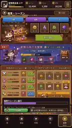

# 9. Reference 07 — キャラクターガチャ

## 9.1 Intended contribution

premium pickup presentation、banner art、rarity、pity、single/ten draw CTAの高揚を示すS10の方向。

## 9.2 KEEP

- pickup castを大きく見せる
- rarityとroleを即読できる
- current pity/progressの視認性
- currency costの事前表示
- one-draw/ten-draw hierarchy
- warm guild officeとmagic machineの世界観
- result前の期待感

## 9.3 CORRECT

- character bannerとweapon bannerを分離する。
- odds、hard pity、featured guarantee、carryover family、exchange、duplicate conversion、ending rule、historyをdraw前に表示する。
- first copyでfunction complete。
- day-one no-payment/no-ad guaranteeをtruthfulに表示する。
- server-authoritative RNG、wallet、pity、historyへ接続するまでdesign reviewと明記する。
- duplicate/mastery/overflowをresult後にatomicに扱う。
- timeoutはpending reconciliation。
- 6F以降に解放し、最初の数分でbattleを押しのけない。

## 9.4 REJECT

- character/weapon混合通常pool
- hidden odds/pity
- first copyではcore skill未完成
- comp gacha/card matching
- fake draw animationだけでlocal rewardをmint
- paid currencyとfree currencyをclientだけで混同
- gachaをgameのtitle/main screenにする

## 9.5 Runtime decomposition

- character banner tab
- weapon banner tab
- odds/pity/guarantee/carryover/exchange/history
- wallet source breakdown
- pending/result/recovery/history reconciliation
- result cards independent of banner raster

---

# 10. Reference 08 — 武器・鍛冶・ビルド

## 10.1 Intended contribution

forge atmosphere、selected weapon detail、inventory、equip/build comparison、progressを示すS07の方向。

## 10.2 KEEP

- blacksmith catとforge background
- selected weaponを大きく見せる
- character portraitとequipped weaponの接続
- weapon category/filter
- build comparison
- upgrade result preview
- equipment gridのscanability

## 10.3 CORRECT

- 常設characterは1本のweaponを装備する。
- N/R確定weaponでprimary rolesを覆う。
- random substat mazeを入れない。
- dismantlingを大量日課にしない。
- auto-dismantleを初期coreとして扱わない。
- build diagnosisを、damage/survival/counter/shop synergyへ接続する。
- owned/equipped/locked/unknownをtruthfulにする。
- weapon gachaはcharacter gachaと別。
- enhancement cost/resultはserver-authoritative scope時にatomic contractへ接続する。

## 10.4 REJECT

- mass dismantling loop
- inventory cleanupが主play
- random substat reroll maze
- dozens of tiny unreadable weapons
- image-baked stats
- all higher rarity weapons being universal best

## 10.5 Runtime decomposition

- forge background layers
- selected weapon render
- equipment slot
- inventory grid with virtualization
- build diagnosis
- compare/preview
- ownership/equip states

---

# 11. Reference 09 — 長期復興メタ

## 11.1 Intended contribution

塔攻略に応じて拠点が豊かになるvisual progression、long-term goal、building unlockを見せる将来層の方向。

## 11.2 KEEP

- tower progressがworld restorationとして目に見える
- colorful cat settlement
- building identityとunlock milestone
- long-term progress summary
- economyがbattle成果から派生する感覚
- campaignの区切りを視覚化する

## 11.3 CORRECT

- 初期versionのcore loopには入れない。
- guild HQ、friend、research、harbor等はsealed product decisionが出るまでfuture concept。
- competitive guild systemへ直結させない。
- restorationはbattle/tower achievementのvisual rewardであり、city builderへ主役交代しない。
- unlock floor表記はunbounded towerのmilestoneとして扱う。
- buildingをmanual collection choresへしない。

## 11.4 REJECT

- initial guild competition
- social obligation/raid schedule
- city-management dashboard主役
- restorationがtower combatを置き換える
- 30F/40F/50Fの具体unlockをauthorityなしで固定

## 11.5 Future decomposition

- long-term hub background variants
- milestone-driven restoration state
- noncompetitive building unlocks
- tower-linked support summaries
- no initial implementation during V2-0/V2-1

---

# 12. Reference 10 — ログイン・イベント・シーズン

## 12.1 Intended contribution

login bonus、daily mission、limited event、reward cards、calendar、season progressionを整理するvisual vocabulary。

## 12.2 KEEP

- calendar grid
- current claimの強いfocus
- reward cardのscanability
- newcomer/monthly/returnerのtab family
- inbox/historyへの導線
- event bannerをcardとして分離する
- claimable/pending/claimedのstate differentiation

## 12.3 CORRECT

- S12はnewcomer/monthly/returner login、inbox、historyを主責務にする。
- initial versionでdense limited event scheduleを作らない。
- battle passを入れない。
- login campaign ID/version、server period、missed-day ruleを固定する。
- retryで別campaignへ差し替えない。
- claimはserver-authoritative、idempotent、history reconciled。
- guild関連rewardを初期scopeから外す。
- missionはcore loopを邪魔しない軽い補助にする。

## 12.4 REJECT

- battle-pass-like paid/free two-lane track
- guild ranking/competition reward
- FOMO中心の密集event
- forced daily chores
- fake claim badge
- client-only login reward

## 12.5 Runtime decomposition

- campaign tabs
- calendar
- claim state
- reward preview
- inbox/history
- pending/retry/recovery
- no battle pass in initial scope

---

# 13. 参考画像に存在しない必須screen

## 13.1 S04 Floor Clear / Reward / Choice

新規設計が必要。

Required:

- defeatからfloor clearへ因果接続
- exact reward sourceとgrant state
- rescue/choiceがある場合のtruthful option
- pending/retry/recovery
- next floor continuation
- no forced gacha popup

## 13.2 S09 Tower Return

新規設計が必要。

Required:

- highest floor/current run
- loss
- keep
- gain
- ruby source
- reclear forecast
- quote expiry/version
- confirm/pending/committed/recovery
- same-best-floor anti-farming explanation
- Floor 1 restart and acceleration preview

## 13.3 Failure and recovery states

10枚は主にnormal状態である。以下は別途Golden Masterとruntime証拠が必要。

- startup loading
- migration required
- offline reconciliation
- network stale
- reward pending
- result recovery
- unknown ownership
- shop delivery retry
- gacha pending/history recovery
- purchase restore/refund/revocation
- tower-return timeout/reload
- large text
